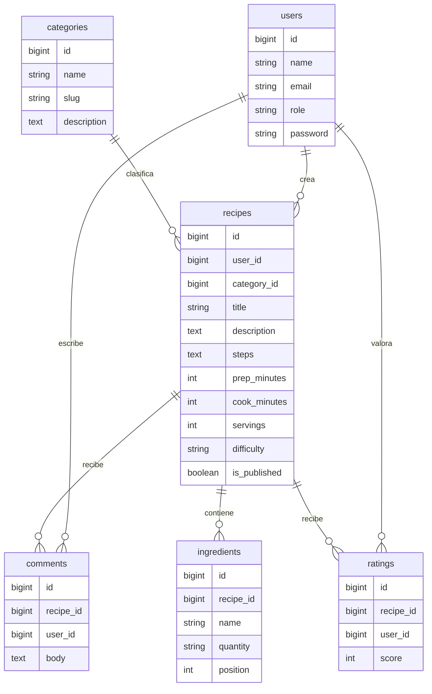

# Recetas Colaborativas

Aplicacion web en Laravel para que usuarios publiquen recetas, agreguen ingredientes, comenten variaciones y valoren recetas de otros miembros. El proyecto cumple con autenticacion Breeze, roles, CRUD, API REST, migraciones, seeders y vistas Blade.

## Requisitos

- XAMPP con Apache/MySQL o PHP CLI de XAMPP.
- PHP 8.2.
- Composer.
- Node.js y NPM.
- Base de datos MySQL `recetas_colaborativas`.

## Instalacion

```bash
composer install
npm install
copy .env.example .env
php artisan key:generate
php artisan migrate:fresh --seed
npm run build
php artisan serve --host=127.0.0.1 --port=8000
```

Si la base no existe, crearla primero:

```sql
CREATE DATABASE recetas_colaborativas CHARACTER SET utf8mb4 COLLATE utf8mb4_unicode_ci;
```

## Usuarios De Prueba

Todos usan la contrasena `password`.

| Rol | Email | Acceso |
| --- | --- | --- |
| admin | admin@recetas.test | Administra categorias, recetas y comentarios |
| usuario | ana@recetas.test | Crea recetas, comenta y valora |
| usuario | luis@recetas.test | Crea recetas, comenta y valora |

## Modelo De Datos



## CRUD

- Recetas: listado publico, detalle publico, crear/editar/eliminar para usuarios autenticados. El autor o admin puede editar/eliminar.
- Categorias: CRUD completo protegido para rol `admin`.
- Comentarios/valoraciones: usuarios autenticados pueden comentar y valorar; autor del comentario o admin puede eliminar.

## Roles Y Accesos

| Ruta | Usuario invitado | Usuario | Admin |
| --- | --- | --- | --- |
| `/`, `/recipes`, `/recipes/{id}` | Ver | Ver | Ver |
| `/recipes/create`, `POST /recipes` | No | Si | Si |
| `/recipes/{id}/edit`, `PUT /recipes/{id}` | No | Solo propias | Todas |
| `/categories/*` | No | No | Si |
| `POST /recipes/{id}/comments` | No | Si | Si |
| `DELETE /comments/{id}` | No | Propios | Todos |

## API REST

Autenticacion para endpoints protegidos: generar token con `POST /api/tokens` y usar `Authorization: Bearer {token}`.

### Obtener Token

`POST /api/tokens`

```json
{
  "email": "admin@recetas.test",
  "password": "password",
  "device_name": "postman"
}
```

### Endpoints

| Metodo | Endpoint | Proteccion | Descripcion |
| --- | --- | --- | --- |
| GET | `/api/recipes` | Publico | Lista recetas paginadas |
| GET | `/api/recipes/{id}` | Publico | Muestra una receta |
| POST | `/api/recipes` | Token usuario/admin | Crea receta |
| PUT/PATCH | `/api/recipes/{id}` | Token autor/admin | Actualiza receta |
| DELETE | `/api/recipes/{id}` | Token autor/admin | Elimina receta |
| GET | `/api/categories` | Publico | Lista categorias |
| GET | `/api/categories/{id}` | Publico | Muestra categoria con recetas |
| POST | `/api/categories` | Token admin | Crea categoria |
| PUT/PATCH | `/api/categories/{id}` | Token admin | Actualiza categoria |
| DELETE | `/api/categories/{id}` | Token admin | Elimina categoria sin recetas |

Ejemplo de crear receta:

```json
{
  "category_id": 1,
  "title": "Avena colaborativa",
  "description": "Receta base para desayunos rapidos que otros usuarios pueden mejorar.",
  "steps": "Mezclar avena con leche, cocinar cinco minutos y servir con fruta.",
  "prep_minutes": 5,
  "cook_minutes": 5,
  "servings": 2,
  "difficulty": "facil",
  "is_published": true,
  "ingredients": [
    { "name": "Avena", "quantity": "1 taza" },
    { "name": "Leche", "quantity": "2 tazas" }
  ]
}
```

## Reglas Del Negocio

- Una receta siempre pertenece a un usuario y una categoria.
- Una receta debe tener al menos un ingrediente.
- Cada usuario puede valorar una receta una sola vez; si vuelve a valorar, se actualiza su calificacion.
- Las categorias con recetas asociadas no se eliminan para conservar integridad.
- Usuarios normales solo modifican sus propias recetas y comentarios.
- Admin puede administrar categorias y moderar recetas/comentarios.

## Problemas Encontrados Y Solucion

- Las migraciones de `recipes` e `ingredients` se generaron con el mismo segundo de timestamp; Laravel intento crear ingredientes antes que recetas. Se renombro la migracion de ingredientes para ejecutar despues.
- Los tests de Breeze fallaban antes del build porque faltaba el manifest de Vite. Se ejecuto `npm run build`.
- El test base necesitaba base migrada porque `/` consulta recetas. Se agrego `RefreshDatabase`.

## Conclusiones

El proyecto integra un flujo completo de colaboracion: usuarios crean contenido, la comunidad aporta comentarios y valoraciones, y el administrador conserva control sobre categorias y moderacion. La API permite probar el CRUD desde Postman con respuestas JSON y autenticacion por token.
